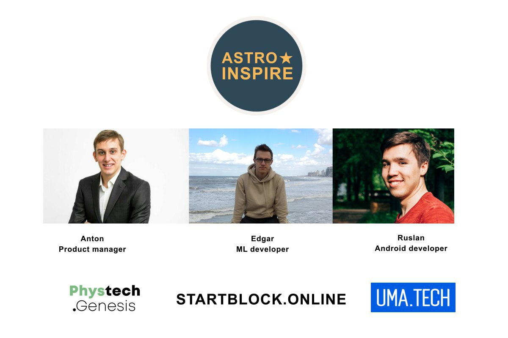
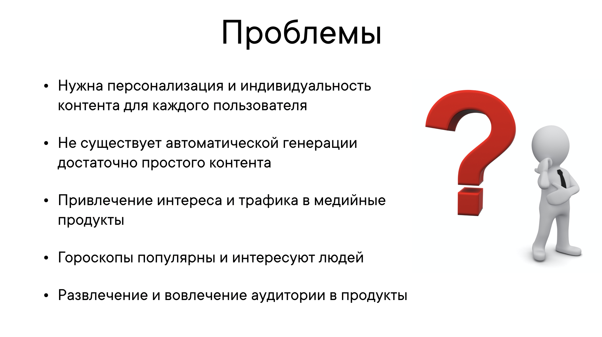
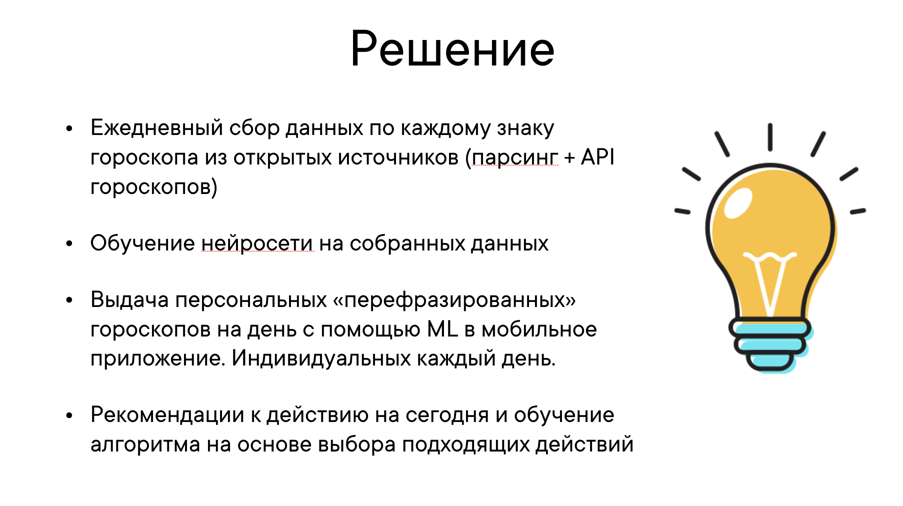
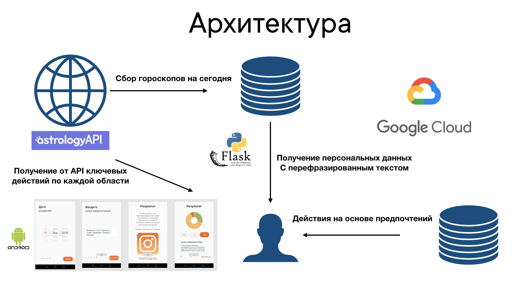
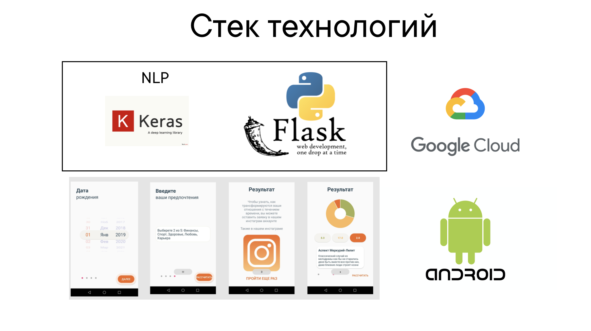
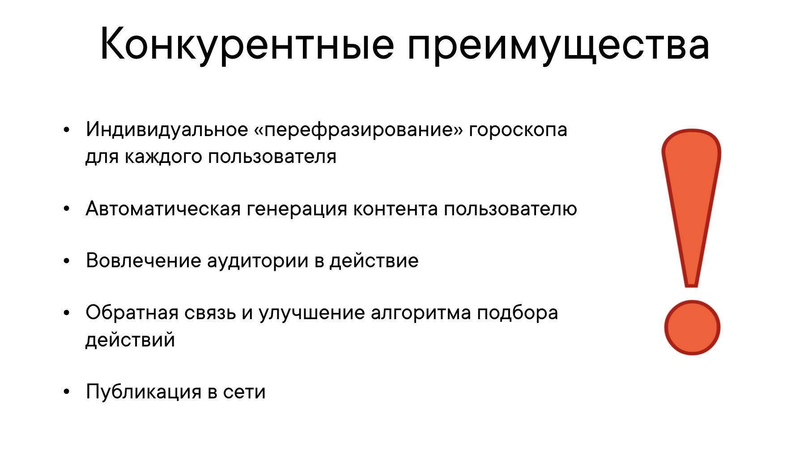
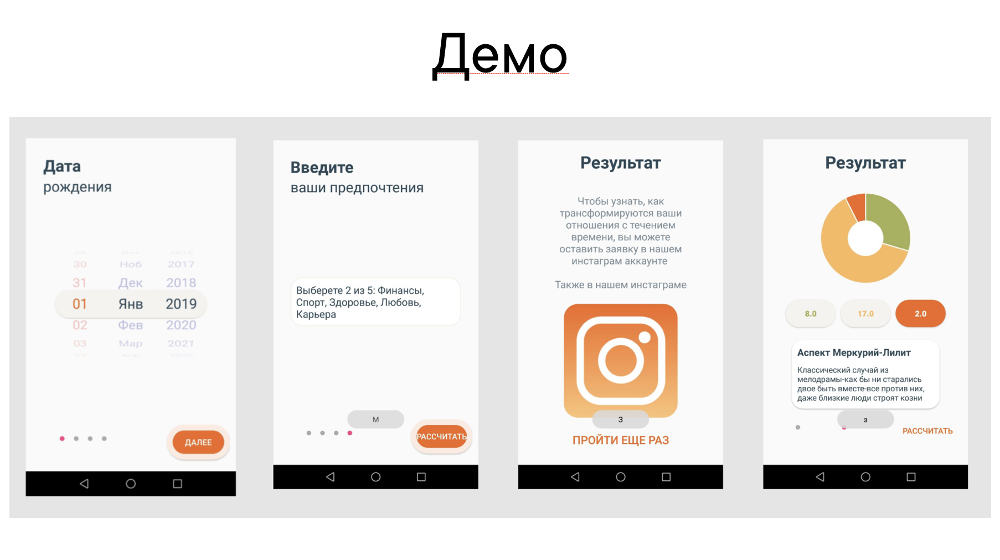
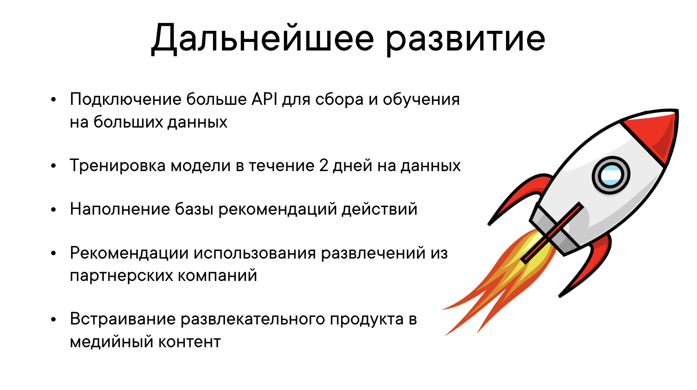

# Horoscope_hack

# Структура

<ol type="1" style="font-size: x-large;">
  <li> <a href="https://github.com/kanzeparov/Horoscope_hack#проблема">Проблема</a>
  <li> <a href="https://github.com/kanzeparov/Horoscope_hack#решение">Решение</a>
<ol type="a" style="font-size: large;">
  <li> <a href="https://github.com/kanzeparov/Horoscope_hack#архитектура">Архитектура</a>
  <li> <a href="https://github.com/kanzeparov/Horoscope_hack#стек-технологий">Стек технологий</a>
  <li> <a href="https://github.com/kanzeparov/Horoscope_hack#конкурентные-преимущества">Конкурентные преимущества</a>
</ol>
<li> <a href="https://github.com/kanzeparov/Horoscope_hack#демо">Демо</a>    
<li> <a href="https://github.com/kanzeparov/Horoscope_hack#установка">Установка</a>
  <ol type="a" style="font-size: large;">
  <li> <a href="https://github.com/kanzeparov/Horoscope_hack#мобильное-приложение">Мобильное приложение</a>
  <li> <a href="https://github.com/kanzeparov/Horoscope_hack#сервер-с-нейронной-сетью">Сервер с нейронной сетью</a>
  </ol>  
<li> <a href="https://github.com/kanzeparov/Horoscope_hack#дальнейшее развитие">Дальнейшее развитие</a>
<li> <a href="https://github.com/kanzeparov/Horoscope_hack#команда">Команда</a>
</ol>

# Проблема

# Решение

### Архитектура

### Стек технологий

### Конкурентные преимущества

# Демо

# Установка

### Мобильное приложение

Android Studio 3.1

### Сервер с нейронной сетью

Python3, pip3 

Packages: keras,tensorflow,flask

# Дальнейшее развитие

# Команда

